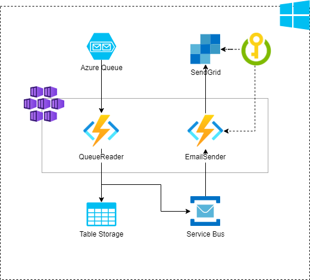

# Hello Functions




# Quickstart
https://github.com/dapr/azure-functions-extension/blob/master/docs/quickstart.md

# Create¡im from scratch
```
mkdir hello-functions
cd hello-functions
func init hello-functions // select dotnet as worker runtime
dotnet add package Microsoft.Azure.WebJobs.Extensions.Storage
dotnet add package Dapr.AzureFunctions.Extension
func new QueueReader # QueueTrigger
func new EmailSender # ServiceBusTopicTrigger
````

# Require data

Remember run bellos commands to know appId for secrets, and to save locallly .pfx certifate
```
az ad sp list --display-name ServicePrincipal
az keyvault secret download --vault-name dapr-keyvault --name CertName --encoding base64 --file c:\users\jlguerrero\dapr-keyvault.pfx
```

# Running sample

`dapr run --app-id hello-functions --dapr-http-port 3501 -p 3001 --components-path .\dapr\components -- func host start`


